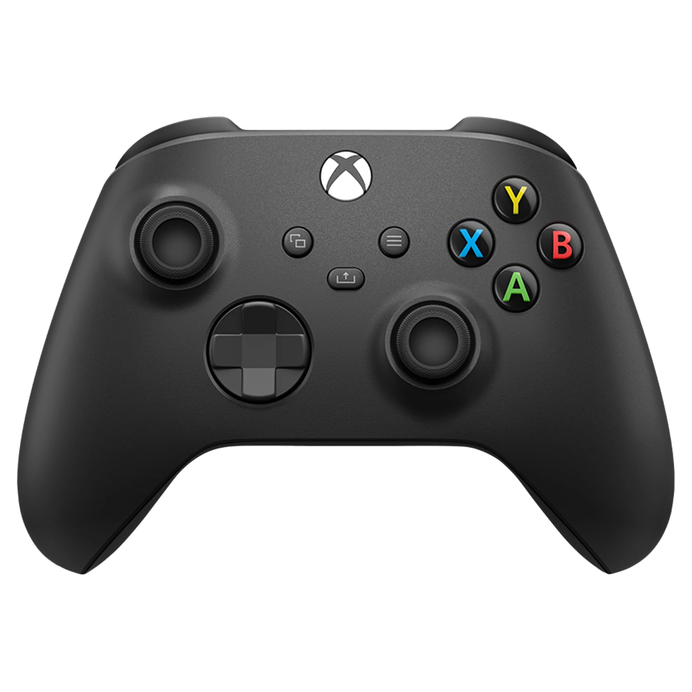

# Controller Bindings



### Left Bumper
- *Doesn't have coral*: Coral intake
- *Has coral*: moves elevator to L3
    - Another Click: dispenses coral
    - Hold: Align to right reef 

### Right Bumper
- *Has coral*: moves elevator to L3
    - Hold: Align to left reef 
- *Doesn't have coral*: Algae removal 2

### Menu Button
- *Has coral*: moves elevator to L2
- *Doesn't have coral click*: Algae removal 1
- *Doesn't have coral hold*: Align to center of reef

### Share Button
- *Has coral*: moves elevator to L2
- *Doesn't have coral and held*: ground intake??? (pls dont use)

### Left Trigger
- Ground pivot zero

### Right Trigger
- Moves elevator to L1

### Left stick
- drive

### Right stick
- drive

### DPAD Up
- Reset field orientation

### DPAD Down
- Zero elevator

### X Button
```java
joystick.x().debounce(0.25).onTrue(climber.setWinchPosition(ClimberConstants.kUpAngle))
      .onTrue(groundPivot.setAngleCommand(GroundPivotConstants.kOutAngle).repeatedly().asProxy().withInterruptBehavior(InterruptionBehavior.kCancelSelf));
```
- climber stuff

### B Button
```java
joystick.b().onTrue(climber.setWinchPosition(Rotations.of(20)).raceWith(groundPivot.setAngleCommand(GroundPivotConstants.kOutAngle).repeatedly()));
```
- climber stuff

### Y Button
```java
joystick.y().whileTrue(climber.setVoltage(Volts.of(12))).onFalse(climber.setVoltage(Volts.zero()));
```
- climber stuff


